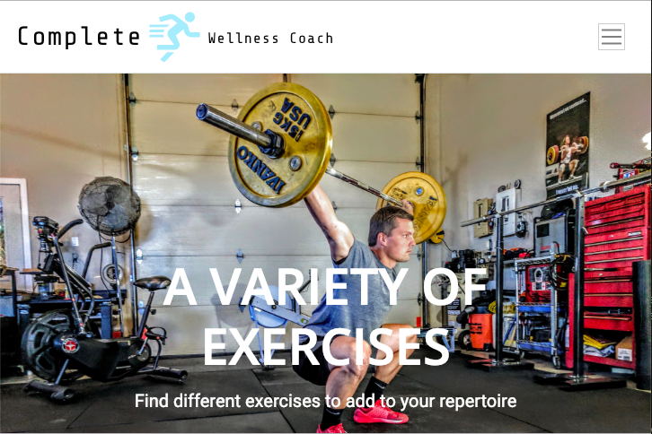

# Complete Wellness Coach

Complete Wellness Coach is a web based health and fitnessed app that uses html, css, and javascript to provide a user with health information, exercises, food recipes, and calorie calculations.

## How it Works

A user visits the page and can choose to either find recipes, view different exercises, or provide information that would give them caloric calculations for their personal fitness goals.

### Finding Recipes

In this page the user can search a food product and they will be provided with nutritional facts and recipes that incorporates the searched product. The user can also choose from recipe categories such as low-fat, low-carb, high-fiber, and high-protein.

### Finding Exercises

In this page the user is presented with different exercises. Each exercise provides the user with information about the exercise and how it should be performed.

### What are your goals?

If the user chooses to complete the "what are your goals" form then their basal metabolic rate is calculated and they are shown how many calories they need to eat in order to achieve their goal. They are also provided with an example of a daily meal plan to reach their caloric goal.

### View the application below
https://willrackley.github.io/Project-One/
